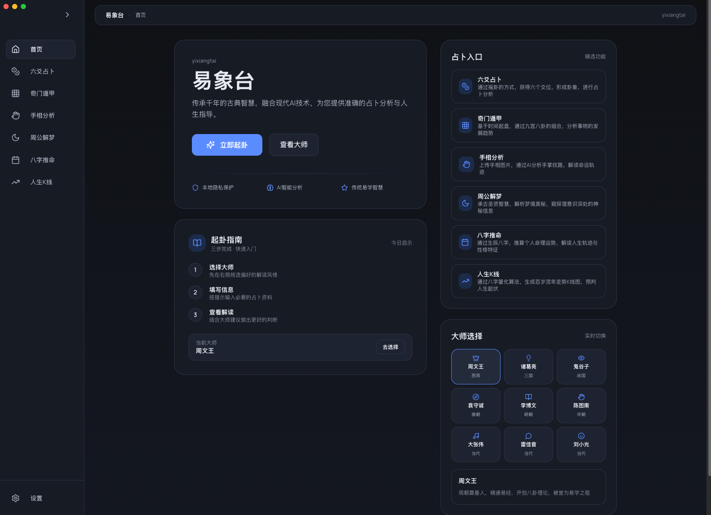
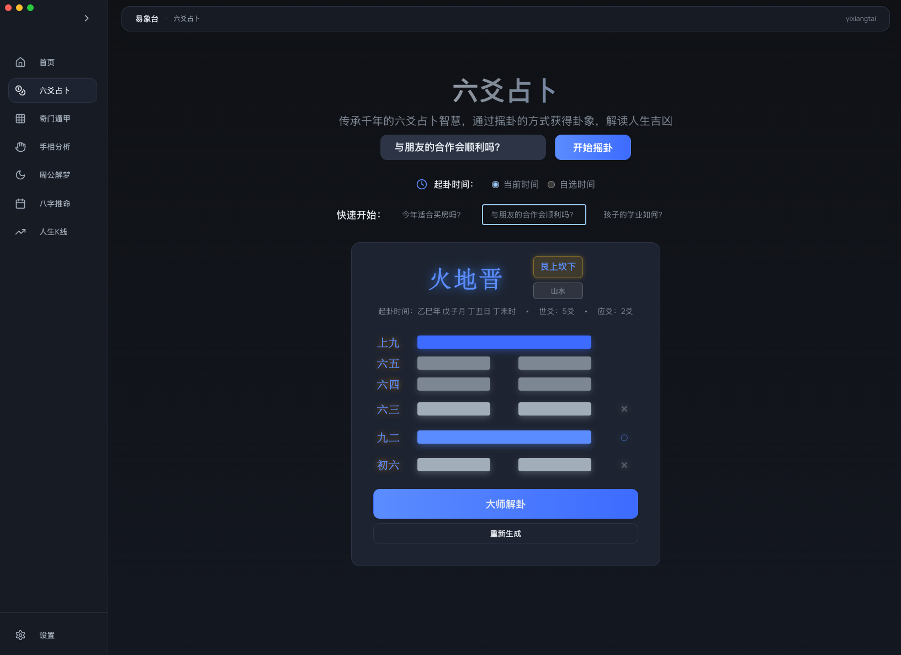
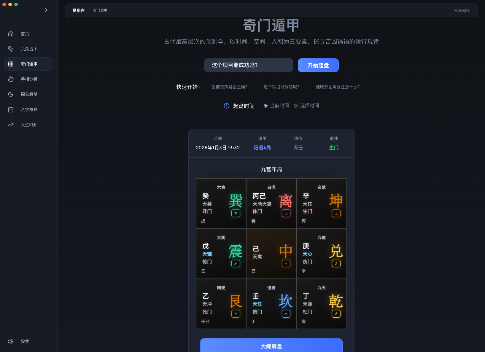
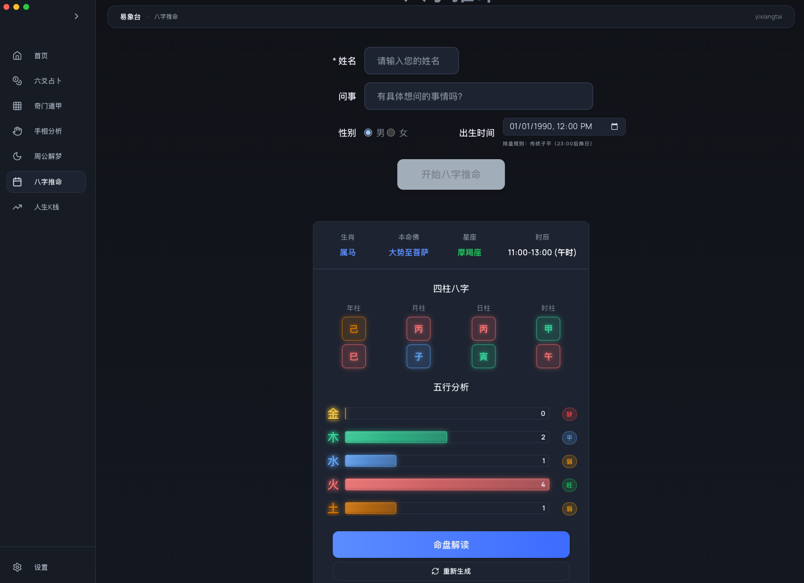
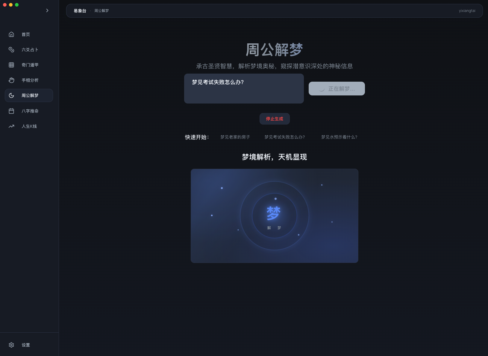
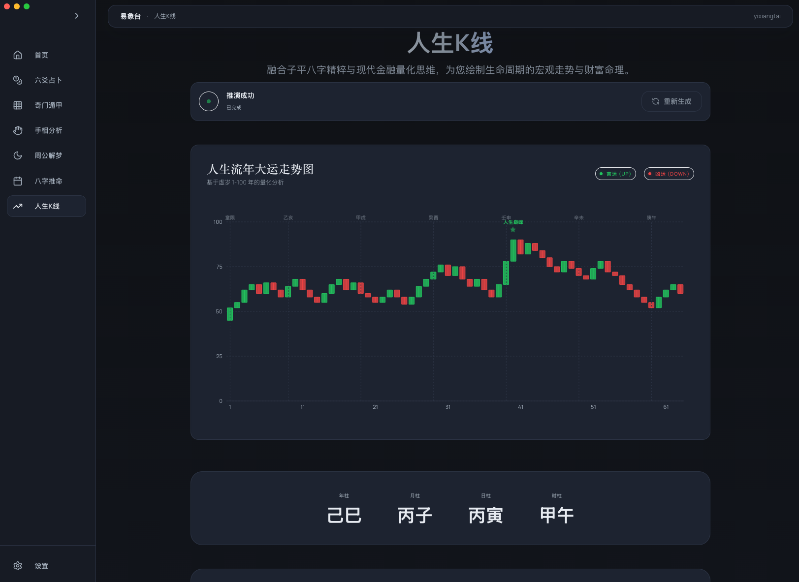

# 易象台 yixiangtai

易象台是一套面向大众的传统占卜与命理分析系统，融合古法术数与现代 AI 能力，提供六爻、奇门遁甲、八字推命、手相分析、周公解梦等完整体验，并支持 Web 与 Electron 桌面端。

## ✨ 项目特色

- 传承千年占卜智慧，结合 AI 技术提供深度解读
- 六爻、奇门遁甲、八字推命、手相分析、周公解梦等模块化占卜系统
- 人生 K 线图：基于八字命理的 100 年运势可视化分析与量化评分
- 9 位虚拟大师，多风格解读（古代圣贤 + 当代名人）
- 后端 API 代理服务，保护密钥安全，适合公开部署
- 响应式布局，兼容桌面与移动端
- 完整的占卜历史管理与导出能力

## 📱 项目展示

<table>
  <tr>
    <td align="center">
      
      <br/>
      <b>🏠 主页界面</b>
      <br/>
      <sub>简洁优雅的主页设计，提供多种占卜方式选择</sub>
    </td>
    <td align="center">
      
      <br/>
      <b>🔮 六爻占卜</b>
      <br/>
      <sub>传统六爻占卜，包含摇卦动画和详细解读</sub>
    </td>
  </tr>
  <tr>
    <td align="center">
      
      <br/>
      <b>⭐ 奇门遁甲</b>
      <br/>
      <sub>专业奇门遁甲分析，提供时局预测和策略建议</sub>
    </td>
    <td align="center">
      
      <br/>
      <b>🧭 八字推命</b>
      <br/>
      <sub>自动排盘与五行分析，洞察命理走势</sub>
    </td>
  </tr>
  <tr>
    <td align="center">
      
      <br/>
      <b>🌙 周公解梦</b>
      <br/>
      <sub>梦境解析与象征解读，提炼潜意识信息</sub>
    </td>
    <td align="center">
      
      <br/>
      <b>📊 人生K线图</b>
      <br/>
      <sub>基于八字命理的 100 年运势可视化分析</sub>
    </td>
  </tr>
</table>

## 🔧 技术栈

- 前端：React 19 + TypeScript + Vite 6
- 样式：Tailwind CSS 4.1
- 状态管理：Zustand
- 动效：Framer Motion
- AI 服务：Google Gemini API
- 桌面端：Electron
- 后端：Node.js + Express（API 代理）

## 🎭 虚拟大师团队

### 古代圣贤
- 周文王（西周）- 易学之祖，精通八卦理论
- 诸葛亮（三国）- 智谋无双，精通奇门遁甲
- 鬼谷子（战国）- 纵横家始祖，善于观人识心
- 袁守诚（唐朝）- 著名术士，精通算命卜卦
- 李博文（明朝）- 易学大师，博学多才
- 陈图南（宋朝）- 相学宗师，精通面相手相

### 当代名人
- 大张伟 - 音乐人，幽默风趣的现代解读
- 雷佳音 - 知名演员，诚恳接地气的朴实风格
- 刘小光 - 二人转演员，浓厚东北味儿的幽默解读

## 📁 项目结构

仓库主代码位于 `yixiangtai/` 目录：

```
.
├── yixiangtai/           # 前端 + Electron + 后端
│   ├── backend/          # API 代理服务
│   ├── public/           # 静态资源
│   ├── src/              # 前端源代码
│   ├── electron/         # Electron 主进程
│   └── build/            # 图标与构建资源
├── README.md
└── 使用说明.md
```

## ✅ 环境要求

- Node.js 20+（推荐 20 LTS 或更高版本）
- npm 10+

## 🚀 快速开始（Web / Electron）

### 1. 克隆并进入仓库

```bash
git clone <repository-url>
cd yixiangtai
```

### 2. 安装前端依赖

```bash
cd yixiangtai
npm install
```

### 3. 配置 Gemini API 密钥（推荐使用环境变量）

方法一：使用 `.env`（推荐）

```bash
cp .env.example .env
# 编辑 .env，设置 VITE_GEMINI_API_KEY=你的密钥
```

方法二：应用内设置页面配置

- 启动应用后进入设置页
- 在 “API 配置” 中输入密钥并保存

方法三：启用后端代理（更安全，适合公开部署）

```bash
cd backend
npm install
cp env.example .env
# 编辑 .env，设置 GEMINI_API_KEY=你的密钥
npm start
```

> 提示：密钥请勿写入源码或提交到 Git 仓库。`.env` 已被 `.gitignore` 忽略。

### 4. 启动开发环境

```bash
# Web
npm run dev

# Electron 桌面端（另开终端）
npm run electron-dev
```

访问 `http://localhost:5173`。

## 📦 构建与打包

### Web 版本

```bash
npm run build
```

构建产物输出到 `yixiangtai/dist/`。

### Electron 桌面应用

```bash
# 打包所有平台
npm run dist

# Windows
npm run dist-win

# macOS（需在 macOS 上构建）
npm run dist-mac

# Linux
npm run dist-linux
```

构建产物输出到 `yixiangtai/release/`。

## 🎞️ 动效说明

六爻、奇门等页面已内置 Canvas 动画，无需再放置 MP4 文件。
如需定制动效，可修改 `yixiangtai/src/components/DivinationAnimation.tsx` 与相关样式。

## 🔒 公开发布前检查

- `.env`、`backend/.env` 已被 `.gitignore` 忽略，不会提交
- 请使用 `.env.example` 作为模板，不要把真实密钥写进源码或文档
- 如果曾经提交过密钥，请立即作废并重新生成


## 💖 赞助与支持

这个项目凝聚了大量时间与心力，如果它对你有帮助，欢迎用一杯咖啡的方式支持我继续打磨易象台。感谢你的认可与鼓励！

Receive Crypto

<table>
  <tr>
    <td align="center">
      
      <br/>
      <b>BTC</b>
      <br/>
      <code>bc1qy5favxelvddx6vn83ggpwe2zzjnefxmxrcj2ev</code>
    </td>
    <td align="center">
      
      <br/>
      <b>ETH</b>
      <br/>
      <code>0xEC0cAC8f158035136a4338a05Cdc94F5b88aFa1b</code>
    </td>
    <td align="center">
      
      <br/>
      <b>BNB</b>
      <br/>
      <code>0xEC0cAC8f158035136a4338a05Cdc94F5b88aFa1b</code>
    </td>
  </tr>
  <tr>
    <td align="center">
      
      <br/>
      <b>XRP</b>
      <br/>
      <code>rhPsmMQwPipXA1oLKQzBoJanB1CqRd4Suc</code>
    </td>
    <td align="center">
      
      <br/>
      <b>Litecoin</b>
      <br/>
      <code>LNc12ZhzUWGbCgVVVYyV5K9qQ637YLxpk5</code>
    </td>
    <td align="center">
      
      <br/>
      <b>Shiba Inu</b>
      <br/>
      <code>0xEC0cAC8f158035136a4338a05Cdc94F5b88aFa1b</code>
    </td>
  </tr>
</table>

## 📄 许可证

Apache License 2.0

---

愿古代智慧与现代科技的结合，为你指引人生方向。
